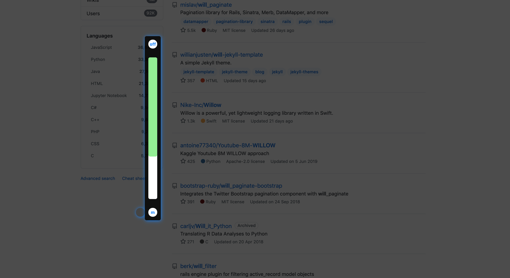

# one_box

---
#### This is a funny chrome extension. Use it, you can get browser night mode. More functions will come soon !
---

*使用原生 ECMAScript 6+ 开发的 chrome 浏览器插件*

## features

>1. 夜间模式，支持滑动条调节暗度，拖拽位置
>2. 开发中...

## install

- 如果你的电脑装有 node 环境
>1. git clone https://github.com/isCagedBird/ONE_BOX.git
>2. 项目根目录下 cnpm install
>3. 项目根目录下 cnpm run build
>4. 使用 Chrome 浏览器安装打包后的 crx 文件
- 否则
>1. download 源码 zip
>2. 打开 Chrome 浏览器的开发者模式，加载已解压的扩展程序，解压源码 zip 包，选择根目录下的 build 文件夹即可

## demo

>

## other

- 该插件会不断更新，加入更多的功能，如果您喜欢的话，请点个 star ，您的支持是我开发的动力